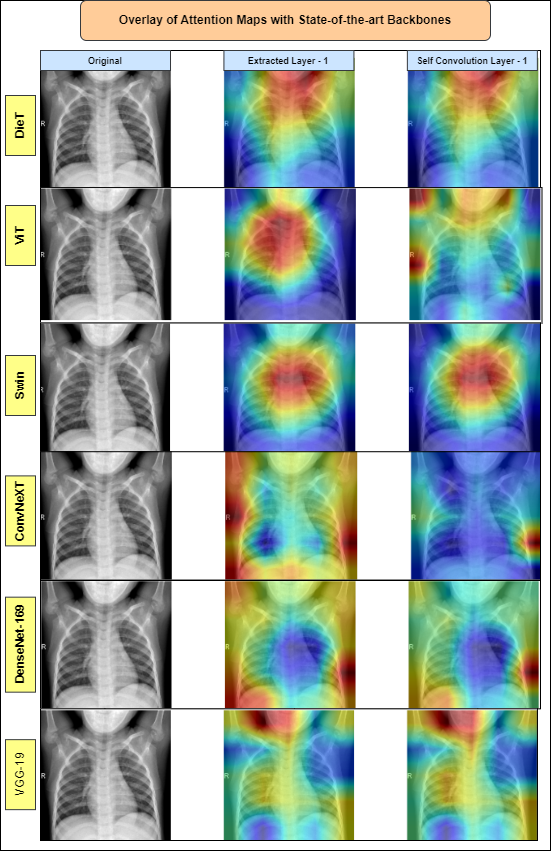

# 🧠 Swin-T-McSWA: Shifted Window Transformer with Multi-context Swin Attention

> **Figure 1:** Architecture of Swin-T-McSWA

---

## 🔍 Overview

**Swin-T-McSWA** integrates a CNN backbone with a custom attention-based transformer decoder to build a high-performing, interpretable, and computationally efficient model for medical image classification — specifically designed for tasks like pneumonia detection from chest X-rays.

This hybrid network fuses:
- **DenseNet169** for hierarchical feature extraction,
- A novel **T-block** to introduce local and global context blending using channel-aware attention,
- **Multi-head Swin Attention blocks** with window shifting for scalable and localized attention modeling,
- Integrated **Explainable AI (XAI)** visualizations for clinical validation.

---

## 📷 Full Pipeline Workflow

> **Figure 2:** Overall flow of Swin-T-McSWA pipeline including training, evaluation, and XAI generation.

---

## 🧬 Input Example

> **Figure 3:** Sample pneumonia X-ray image from the dataset used for training and evaluation.

---

## 🧠 Model Summary

- **Input Resolution:** 180 × 180 × 3
- **Backbone:** DenseNet169 (frozen)
- **T-block:** Custom convolutional and attention mechanism
- **Transformer:** Two-stage Swin-style attention modules
- **Final Classifier:** Dense + Dropout layers

**Model Summary Diagram:**

---

## 🔦 Explainability via Attention Maps

Swin-T-McSWA supports robust post-hoc visual explainability using attention-guided saliency maps:

### XAI View 1:

> **Figure 4:** Deep model attention map highlighting pneumonia-affected lung regions (Layer-wise GradCAM fusion).

### XAI View 2:

> **Figure 5:** Multi-head attention highlighting local-global decision salience.

---

## 📊 Ablation Study

### 🧪 Impact of Transformer Configurations

| Ablation Type                                      | Params (M) | FLOPs (G) | Accuracy (%) | F1-Score (%) |
|---------------------------------------------------|------------|-----------|--------------|--------------|
| Hierarchical vs. Non-Hierarchical Attention       | 37         | 7.2       | 98.47        | 98.03        |
| Shifted Window vs. Full Multi-head Attention      | 37         | 7.2       | 98.46        | 98.01        |
| Window Size (2x2 vs. 4x4 vs. 8x8)                 | 37         | 7.2       | 98.50        | 98.08        |
| Self vs. Cross Attention                          | 37         | 7.2       | 98.35        | 97.98        |
| Positional Encoding: With vs. Without             | 37         | 7.2       | 98.40        | 98.00        |

---

## 🏆 Performance Comparison with SOTA

| Model                        | Accuracy (%) | F1-Score (%) | Parameters (M) | FLOPs (G) |
|-----------------------------|--------------|--------------|----------------|-----------|
| **Swin-T-McSWA (Proposed)** | **98.76**    | **98.17**    | 37             | 7.2       |
| CO-IRv2                     | 94.9         | 94.6         | -              | -         |
| DenseNet201                 | 94.5         | 94.6         | -              | -         |
| ViT-Base                    | 94.2         | 94.1         | 86             | 17.6      |
| ViT-Large                   | 94.3         | 94.2         | 307            | 60+       |
| EfficientFormer-L1          | 94.3         | 94.4         | 12             | 1.3       |
| MobileViT                   | 93.9         | 93.8         | 5.5            | 0.7       |
| BEiT                        | 94.2         | 94.0         | 86             | 17.6      |
| Vision Transformer (ViT)    | 97.61        | 95.00        | -              | -         |

🔧 Setup and Usage
bash
Copy
Edit
# Clone the repo
git clone https://github.com/your-name/swin-t-mcswa.git
cd swin-t-mcswa

# Install dependencies
pip install -r requirements.txt

# Run training
python train.py --dataset_path ./data/ --epochs 100

# Inference
python inference.py --input ./test_image.png
🧠 Citation
bibtex
Copy
Edit
@article{banerjee2025swinmcswa,
  title={Swin-T-McSWA: Shifted Window Transformer with Multi-context Swin Attention for Medical Image Classification},
  author={Banerjee, Tathagat},
  journal={arXiv preprint arXiv:2506.xxxxx},
  year={2025}
}

